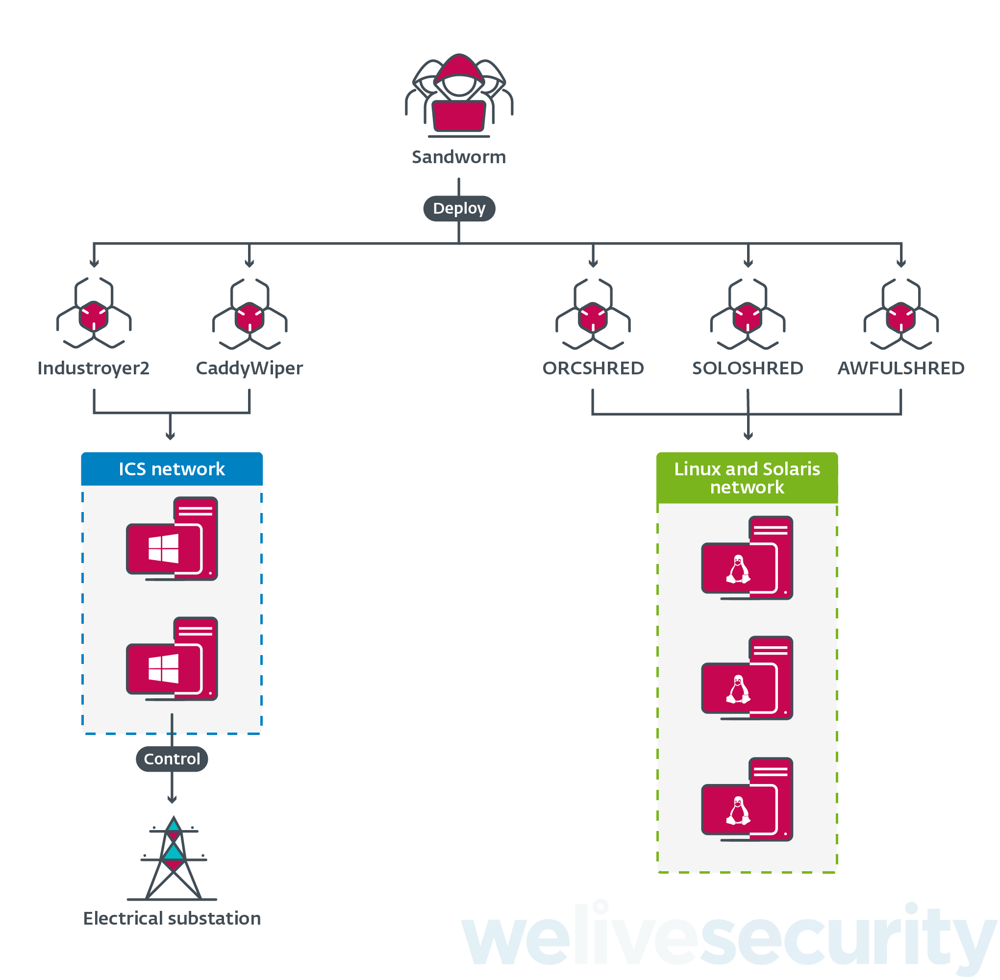

# INDUSTROYER 2

First seen in 2022, it's a malware that targets specifically ICS, with the aim to harm the critical infrastructure like power grids. It utilizes messages written in **IEC 60870-5-104 (IEC-104)** protocol to send *ON* or *OFF* commands. **IEC-104** is used for power system monitoring and control over TCP and is mainly implemented in Europe and the Middle East.

This malware variant, unlike [INDUSTROYER](https://cyberlaw.ccdcoe.org/wiki/Industroyer_%E2%80%93_Crash_Override_(2016)) used in 2016 to attack Ukraine’s national power company (Ukrenergo), allows actors to embed customized configurations that modify the malware’s behavior to specific intelligent electronic devices (IEDs) (e.g., protection relays, merging units, etc.) within the target environment.

## Technical analysis of [welivesecurity.com](https://www.welivesecurity.com/2022/04/12/industroyer2-industroyer-reloaded/)

In addition to Industroyer2, Sandworm used several destructive malware families including CaddyWiper, ORCSHRED, SOLOSHRED and AWFULSHRED. We first discovered CaddyWiper on 2022-03-14 when it was used against a Ukrainian bank – see our [Twitter thread about CaddyWiper](https://twitter.com/ESETresearch/status/1503436420886712321). A variant of CaddyWiper was used again on 2022-04-08 14:58 against the Ukrainian energy provider previously mentioned.

Industroyer2 was deployed as a single Windows executable named `108_100.exe` and executed using a scheduled task on 2022-04-08 at 16:10:00 UTC. It was compiled on 2022-03-23, according to the PE timestamp, suggesting that attackers had planned their attack for more than two weeks.

Before connecting to the targeted devices, the malware terminates a legitimate process that is used in standard daily operations. In addition to that, it renames this application by adding .MZ to the filename. It does so in order to prevent automatic re-start of this legitimate process.

In coordination with the deployment of Industroyer2 in the ICS network, the attackers deployed a new version of the CaddyWiper destructive malware. We believe it was intended to slow down the recovery process and prevent operators of the energy company from regaining control of the ICS consoles. It was also deployed on the machine where Industroyer2 was executed, likely to cover their tracks.

## Resources

| RESOURCES                                                                                                                                                                                                                                               |
| ----------------------------------------------------------------------------------------------------------------------------------------------------------------------------------------------------------------------------------------------------- |
| [Graph on Virus Total](https://www.virustotal.com/graph/gdaefb8d12c4b44bbad95ec202210c5a27af65cad2d434b7681ebb52e2d7a4add)                                                                                                                                        |
| [BlackHat 2022 about INDUSTROYER 2](https://www.youtube.com/watch?v=xC9iM5wVedQ)                                                                                                                                                                        |
| [Mandiant's report](https://www.mandiant.com/resources/blog/industroyer-v2-old-malware-new-tricks)                                                                                                                                                   |
| [BlackBerry's report](https://blogs.blackberry.com/en/2022/05/threat-thursday-malware-rebooted-how-industroyer2-takes-aim-at-ukraine-infrastructure)                                                                                                 |
| [CERT-UA#39518](https://cert.gov.ua/article/39518)                                                                                                                                                                                                    |
| [Papers on VX-Undergroud about INDUSTROYER2](https://vx-underground.org/Papers/ICS%20SCADA/Industroyer) |
